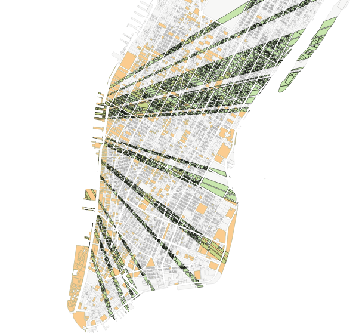
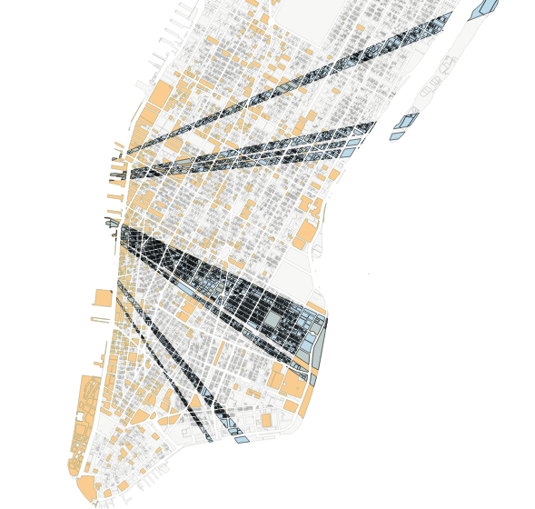
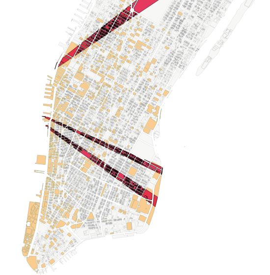

## Line of Sight Project
### Fall 2015 Research Assistant, [CUSP](cusp.edu.cn)
### Team Memebers
- Cindy Y. Liu
- Tengfei Zheng

### Project Purpose
Mapping the line trajectories one of whose sections air pollutions are located (line of sight) by using pollutions' pixels in their hyperspectral images

### Dataset Used
CUSP Urban Observatory's hyperspectral imaging of Manhattan's air pollution. The data includes the date-time, pollution type, pixel number in the images of each detected pollution.

### Results of April 12, 2015
Ammonia   

Cholorodifluoromethane  

Tetrafluoroethane  

